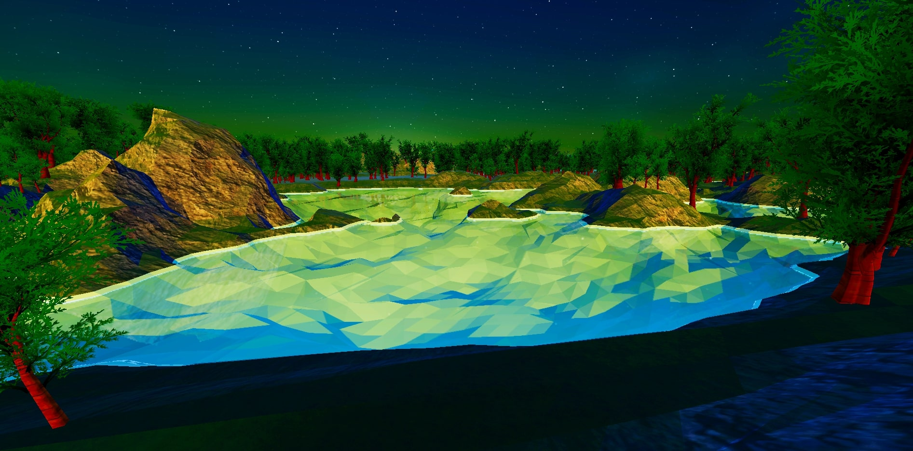

# undaunted-terrain-generation
Multilayer Perlin Noise + Marching Cubes implementation that generates polygonal terrain off of a random seed and includes scripts for terrain simulation.

Can be modified to do more high-poly/low-poly terrain and currently implements all necessary algorithms using HLSL shader code to run the computations simultaneously on the GPU. Includes scripts for placing trees or other terrain features pseudorandomly as well as shader code for a day/night cycle.

Inspired by videos from [Sebastian Lague](https://www.youtube.com/c/SebastianLague/featured)

May include some extraneous scripts and models I was playing around with or testing

Examples of generated terrain (using default Unity camera model Ethan):

